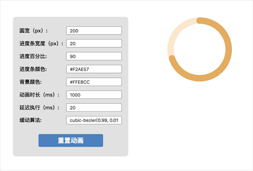
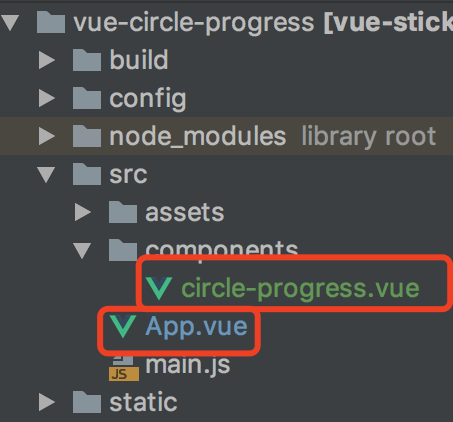

# vue-circle-progress
vue圆形进度条组件，自由可定制




# 示例运行步骤
- 【下载依赖】npm install
- 【运行项目】npm run dev
- 【打开对应链接】浏览器打开对应链接
- 【设置top值示例】http://127.0.0.1:8080/#/


# 源代码
- /src/App.vue是使用圆形进度条组件的代码实例
- 组件源代码为circle-progress.vue，拷贝该文件，直接使用即可

  


# 使用方法如下

 | 参数名 | 值类型 | 是否必填 | 参数作用 | 默认值 |
 | :------: | :------: | :------: | :------: | :------: |
 | id | String | 选填 | 组件的id，多次定义设置不同的值 | 1 |
 |  width | Number | 必填 | 设置圆整体的大小，单位为px | 无 |
 | radius | Number | 必填 | 设置进度条宽度，单位为px | 无 |
 | progress | Number | 必填 | 设置进度百分比 | 无 |
 | barColor | String | 必填 | 设置进度条颜色 | 无 |
 | backgroundColor | String | 必填 | 设置进度条背景颜色 | 无 |
 | delay | Number | 选填 | 延迟多久执行，单位为ms | 20 |
 | duration | Number | 选填 | 动画整体时长，单位为ms | 1000 |
 | timeFunction | String | 选填 | 动画缓动算法 | cubic-bezier(0.99, 0.01, 0.22, 0.94) |
 | isAnimation | Boolean | 选填 | 是否以动画的方式呈现 | true |

  ```
  <circle-progress
    :id="1"
    :width="200"
    :radius="20"
    :progress="70"
    :delay="200"
    :duration="1000"
    :barColor="#F2AE57"
    :backgroundColor="#FFE8CC"
    :isAnimation="true"
    :timeFunction="cubic-bezier(0.99, 0.01, 0.22, 0.94)"
  >
  ```


# 组件原理及详细介绍，请移步[这个文章](https://segmentfault.com/a/1190000016591047)
